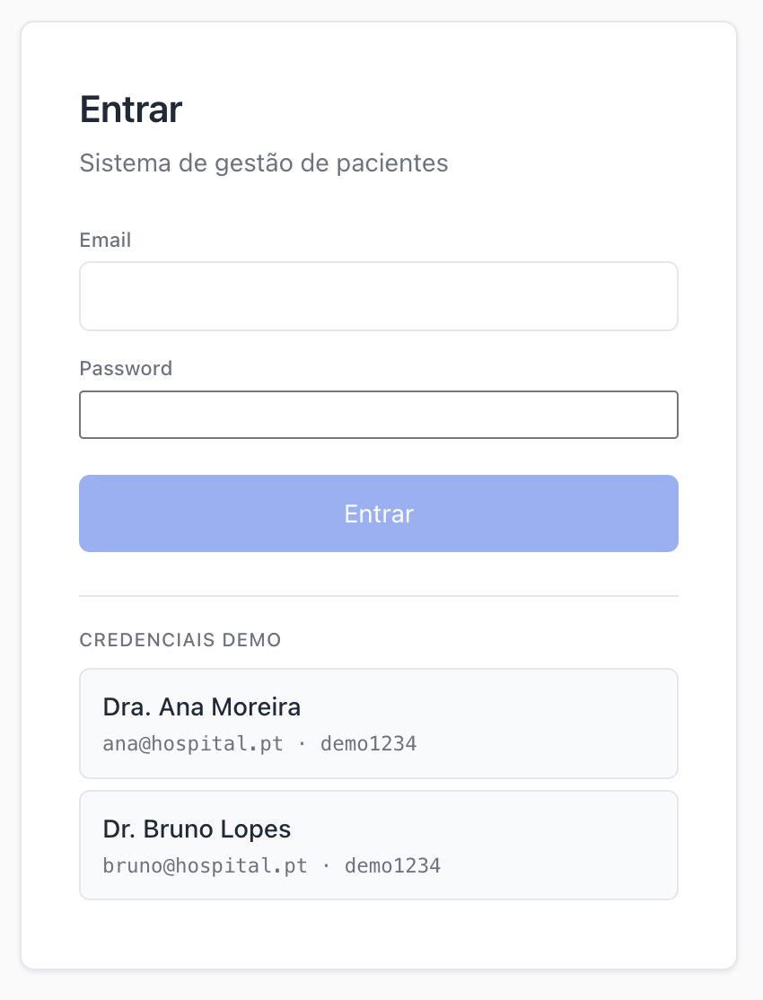
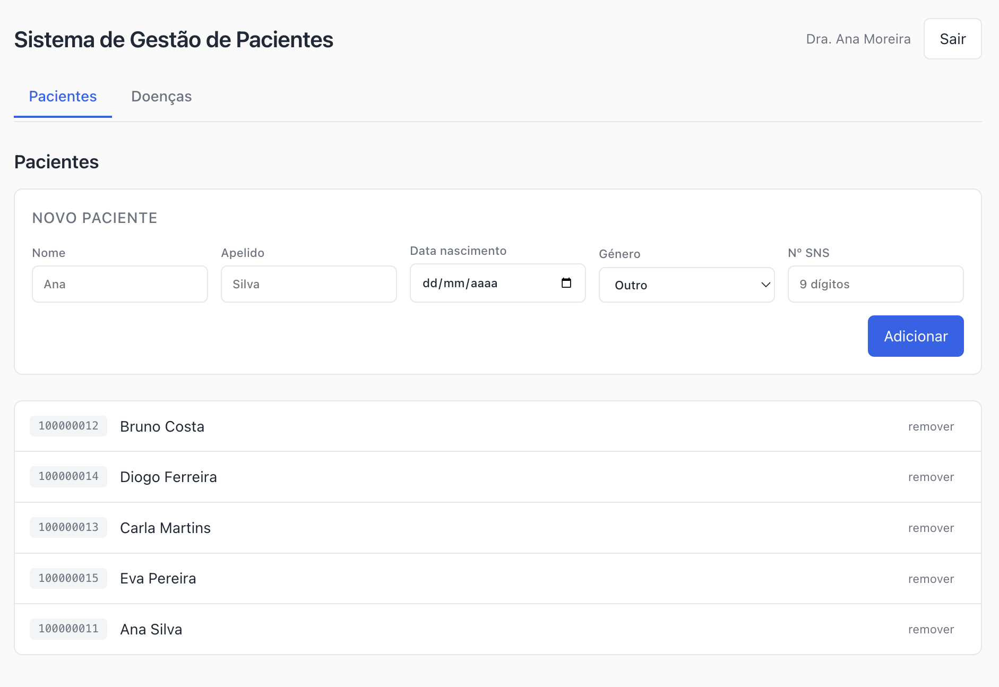
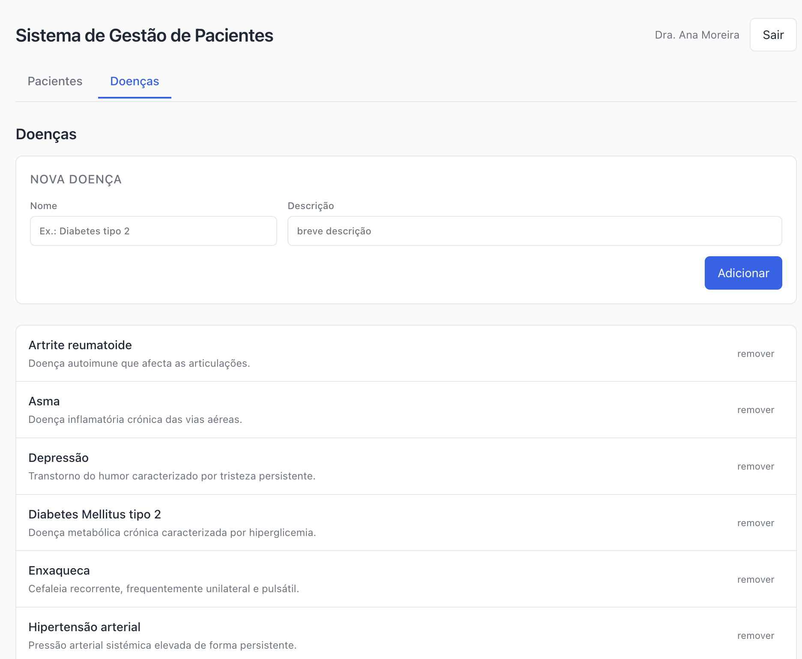
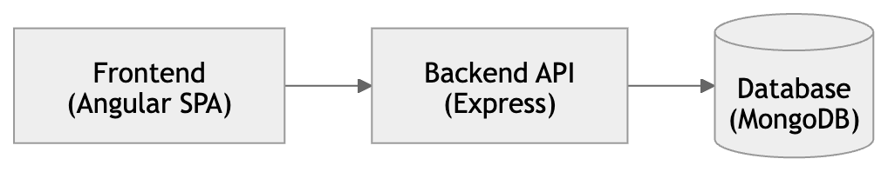
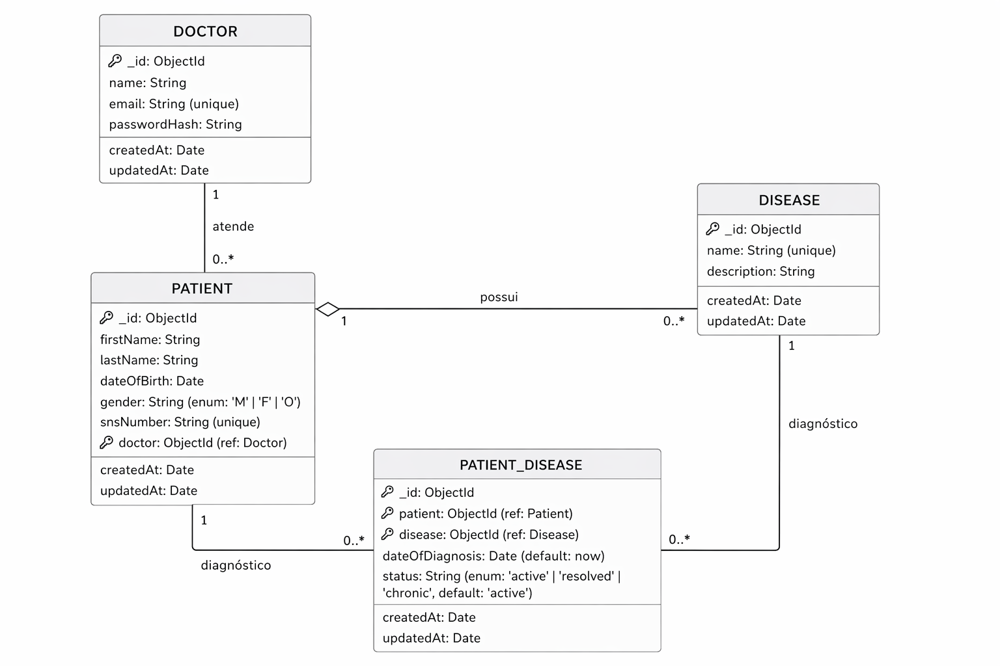

# Sistema de Gestão de Pacientes

Aplicação académica de informática médica: permite a médicos gerir os seus pacientes, manter um catálogo de doenças e registar diagnósticos (relação N:N entre pacientes e doenças).

O projecto está dividido em duas pastas:

- [`medical-backend/`](medical-backend/) — API REST em Node.js + Express + Mongoose sobre MongoDB
- [`medical-frontend/`](medical-frontend/) — SPA em Angular 17 (standalone components)

## Screenshots

| Login | Pacientes | Doenças |
|---|---|---|
|  |  |  |

## Arquitectura



O frontend faz pedidos a `/api/*`; em desenvolvimento o `ng serve` redirige-os via `proxy.conf.json` para `http://localhost:3000`, evitando problemas de CORS. Todos os pedidos excepto `POST /api/auth/login` exigem `Authorization: Bearer <jwt>`.

## Modelo de domínio



**Notas de modelação**:
- Cada paciente pertence a exactamente um médico (1:N). A API filtra todas as operações por `doctor = req.doctorId`, garantindo que um médico só vê os seus pacientes.
- `PatientDisease` é uma colecção de ligação que materializa a relação N:N entre pacientes e doenças, com metadados próprios (`dateOfDiagnosis`, `status`).
- Índice composto único em `(patient, disease)` impede diagnosticar a mesma doença duas vezes ao mesmo paciente.
- As doenças são um catálogo partilhado entre todos os médicos.

## Arranque

### Requisitos
- Node.js 18+
- MongoDB 6+ a correr em `localhost:27017` (ou ajustar `MONGO_URI`)

### Backend

```bash
cd medical-backend
npm install
cp .env.example .env       # ajustar se necessário
npm run seed               # popula médicos, pacientes, doenças e diagnósticos demo
npm run dev                # http://localhost:3000
```

### Frontend

```bash
cd medical-frontend
npm install
npm start                  # http://localhost:4200 (com proxy para o backend)
```

### Credenciais demo

O ecrã de login mostra dois botões que preenchem automaticamente as credenciais:

| Médico | Email | Password |
|---|---|---|
| Dra. Ana Moreira | `ana@hospital.pt` | `demo1234` |
| Dr. Bruno Lopes | `bruno@hospital.pt` | `demo1234` |

Cada médico vê apenas os seus 5 pacientes; o catálogo de doenças é partilhado.

## Rotas da API

Todas as rotas vivem sob `/api`. Todas requerem JWT excepto as marcadas como **pública**.

### Autenticação

| Método | Rota | Descrição | Auth |
|---|---|---|---|
| POST | `/api/auth/login` | Autentica um médico, devolve `{ token, doctor }` | **pública** |
| GET | `/api/auth/me` | Devolve o médico actual (a partir do token) | Bearer |

### Pacientes

| Método | Rota | Descrição |
|---|---|---|
| GET | `/api/patients` | Lista os pacientes do médico autenticado |
| GET | `/api/patients/:id` | Obtém um paciente (se pertencer ao médico) |
| POST | `/api/patients` | Cria paciente (`doctor` injectado do JWT) |
| PUT | `/api/patients/:id` | Actualiza paciente |
| DELETE | `/api/patients/:id` | Remove paciente |

### Doenças (catálogo partilhado)

| Método | Rota | Descrição |
|---|---|---|
| GET | `/api/diseases` | Lista doenças |
| GET | `/api/diseases/:id` | Obtém uma doença |
| POST | `/api/diseases` | Cria doença |
| PUT | `/api/diseases/:id` | Actualiza doença |
| DELETE | `/api/diseases/:id` | Remove doença |

### Diagnósticos (relação paciente ↔ doença)

| Método | Rota | Descrição |
|---|---|---|
| GET | `/api/patients/:id/diseases` | Lista diagnósticos de um paciente (com `disease` populada) |
| POST | `/api/patients/:id/diseases` | Adiciona diagnóstico: `{ diseaseId, dateOfDiagnosis, status }` |
| PATCH | `/api/patient-diseases/:id` | Actualiza estado ou data do diagnóstico |
| DELETE | `/api/patient-diseases/:id` | Remove diagnóstico |

### Outros

| Método | Rota | Descrição | Auth |
|---|---|---|---|
| GET | `/api/health` | Smoke test | pública |

## Estrutura do frontend

```
medical-frontend/src/app/
├── app.component.{ts,html,css}           # shell: header + nav + router-outlet
├── app.config.ts                          # provideRouter + provideHttpClient + interceptor
├── app.routes.ts                          # rotas protegidas com authGuard
├── core/
│   ├── guards/auth.guard.ts
│   ├── interceptors/auth.interceptor.ts   # injecta Bearer + logout em 401
│   ├── models/                            # TS interfaces
│   └── services/                          # HttpClient wrappers
└── features/
    ├── login/
    ├── patients/           · lista + form de novo paciente
    ├── patient-detail/     · form de edição
    ├── patient-diseases/   · embebido no detalhe, gere diagnósticos
    ├── diseases/           · catálogo
    └── disease-detail/
```

## Stack técnica

**Backend**: TypeScript, Express 4, Mongoose 8, bcryptjs, jsonwebtoken, morgan, cors.

**Frontend**: Angular 17 (standalone components), RxJS 7, `@angular/forms` (`ngModel`).

## Fora do âmbito

- Sem testes unitários (a infra do Angular está configurada, mas não há specs)
- Sem refresh tokens — o JWT expira em 12h e obriga a novo login
- Sem auditoria de acções nem logs estruturados
